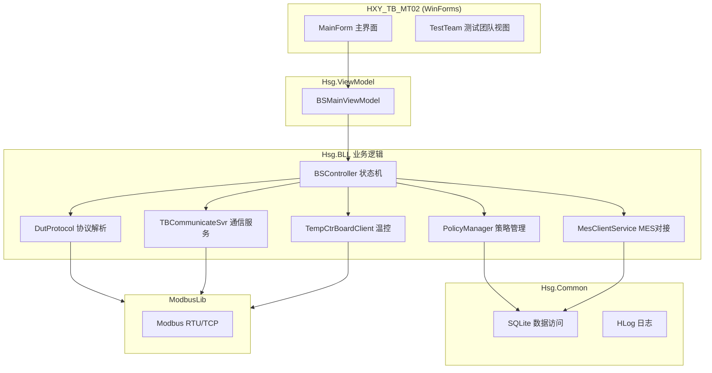

# AC_LPDDR4x_Tools — LPDDR4x SLT 上位机测试系统

基于 .NET Framework 4.8 / WinForms 的 **LPDDR4x 内存芯片系统级测试（SLT）** 上位机软件，用于半导体产线自动化测试。

## 功能概述

- **多通道并行测试**：支持多 DUT（Device Under Test）同时测试，每通道独立状态机控制
- **LPDDR4x 内存测试**：Pattern Test、MemTester、DVFS 测试、Aging 老化测试
- **温度控制集成**：支持高温/常温测试团队的温控板通信（Modbus 协议）
- **MES 对接**：工单管理、测试数据上报制造执行系统
- **策略配置**：灵活的测试策略（Policy）配置，支持 SQLite 存储
- **实时监控**：测试进度、良率统计、通道状态实时显示
- **CSV 导出**：测试结果自动导出 CSV 报表
- **日志系统**：分级日志记录，支持调试/生产模式

## 技术架构



| 模块 | 项目 | 说明 |
|---|---|---|
| 主界面 | `HXY_TB_MT02` | WinForms 应用程序，测试主控界面 |
| 业务逻辑 | `BLL` (Hsg.BLL) | 状态机、DUT 协议、通信服务、策略管理 |
| 公共库 | `Common` (Hsg.Common) | 日志、SQLite 访问、工具类、通用枚举 |
| ViewModel | `Hsg.ViewModel` | MVVM 风格的视图模型层 |
| Modbus 库 | `ModbusLib` | Modbus RTU/TCP 通信协议实现 |
| 测试工具 | `Test` | 单元测试与状态机演示 |
| 工具库 | `Tool` | 辅助工具类 |

## 通信协议

| 协议 | 用途 |
|---|---|
| **HC Protocol** | 与测试板（Handler Board）通信的自定义协议 |
| **CBC Protocol** | 芯片级通信协议，用于 DUT 数据交互 |
| **Modbus RTU/TCP** | 温控板（Temperature Controller）通信 |
| **TCP/UDP** | DUT 连接与数据传输 |
| **Named Pipe** | 进程间通信（主从模式） |

## 状态机设计

系统采用事件驱动的有限状态机（FSM）架构：

- `BSController` — 主控制器状态机（Idle → Running → Pause → Stop）
- `BSTeam` — 测试团队状态机
- `DutMaster` — 单 DUT 状态机
- `DutsManager` — 多 DUT 管理状态机
- `TempCtrTeam` — 温控团队状态机

## 数据库

使用 **SQLite** 存储以下数据：

- `workOrder` — 工单信息（订单号、物料号、测试阶段、超时时间）
- `workStage` — 测试阶段定义（FT 首测 / FRT 失败复测 / PRT 成功复测）

## 依赖项

| 包 | 用途 |
|---|---|
| .NET Framework 4.8 | 运行时 |
| System.Data.SQLite | SQLite 数据库驱动 |
| CircularProgressBar | 圆形进度条控件 |
| WinFormAnimation | 界面动画效果 |

## 快速开始

### 环境要求

- Windows 7+ / Windows 10 / Windows 11
- .NET Framework 4.8
- Visual Studio 2015+ (推荐 VS 2019/2022)

### 编译

```bash
# 用 Visual Studio 打开解决方案
AC_LPDDR4x_Tool.sln

# 或使用 MSBuild 命令行
msbuild AC_LPDDR4x_Tool.sln /p:Configuration=Release /p:Platform="Any CPU"
```

### 运行

```bash
# Debug 模式
HXY_TB_MT02\bin\Debug\AC_LPDDR4x_Tools.exe

# Release 模式
HXY_TB_MT02\bin\Release\AC_LPDDR4x_Tools.exe
```

### 配置文件

测试配置通过 `.cfg` 文件设定，示例 `HG_LP4X_4GB_(8+8)+(8+8)_NV.cfg`：

```ini
[Test config]
VDD1=1950          # 核心电压 1
VDD2=1170          # 核心电压 2
VDDQ=650           # I/O 电压
PatternTest=1      # 开启 Pattern 测试
MemTester=1        # 开启内存测试
DvfsTest=1         # 开启 DVFS 测试
AgingTime=1        # 老化时间
Density=32         # 容量 (Gb)
DieNum=4           # Die 数量
ChannelA_Rank0_Size=8   # 通道 A Rank0 容量
ChannelB_Rank1_Size=8   # 通道 B Rank1 容量
```

## 分支说明

| 分支 | 内容 |
|---|---|
| `main` | LPDDR4x SLT 标准版基线 |
| `hxy` | HXY 扩展版 — 额外包含 `codereview/` 配置和更完善的项目文档 |

## 目录结构

```
LPDDR4_SLT/
├── AC_LPDDR4x_Tool.sln        # Visual Studio 解决方案
├── HXY_TB_MT02/               # 主界面工程 (WinForms)
├── BLL/                        # 业务逻辑层
│   ├── Model/                  # 状态机模型
│   ├── Service/                # 通信/MES 服务
│   ├── config/                 # 配置类
│   └── TempCtr/                # 温控协议
├── Common/                     # 公共库 (日志/SQLite/工具)
├── Hsg.ViewModel/              # ViewModel 层
├── ModbusLib/                  # Modbus 协议库
├── Test/                       # 测试项目
├── Tool/                       # 工具项目
├── DB/                         # 数据库文件
├── lib/                        # 第三方 DLL
├── docs/                       # 项目文档
├── codereview/                 # 代码审查配置 (hxy 分支)
└── pic/                        # 图片资源
```

## License

Internal use — 宏芯宇 (HXY) 半导体测试工具。
